# Modelo de Dados — BEC

Este documento é a fonte de verdade conceitual para as entidades centrais do domínio. Ele descreve um diagrama de classes, não um esquema físico de banco: nomes de tabelas, chaves estrangeiras, índices, nulidade e estratégias de persistência serão definidos nas migrações, sem contrariar as relações aqui estabelecidas.

## Escopo e linguagem do domínio

| Termo | Significado no BEC |
|---|---|
| Instituição | Organização responsável por uma ou mais bibliotecas. |
| Biblioteca | Unidade que mantém leitores, usuários e exemplares. |
| Item bibliográfico | Registro catalográfico abstrato, especializado em Obra ou Periódico. |
| Obra | Título bibliográfico que pode possuir edições e receber contribuições. |
| Periódico | Publicação seriada, como revistas ou jornais, que possui fascículos. |
| Publicação | Manifestação publicada abstrata, especializada em Edição de Obra ou Fascículo de Periódico. |
| Edição | Publicação de uma obra, identificável por ISBN quando aplicável. |
| Fascículo | Publicação individualizada de um periódico, identificável por número e volume. |
| Exemplar | Cópia física de uma publicação (edição ou fascículo) mantida por uma biblioteca. |
| Contribuição | Participação de uma pessoa em um item bibliográfico, identificada pelo seu tipo. |

As regras operacionais de prazo, renovação, fila de reserva, auditoria, retenção e concorrência não são inferidas pelo diagrama. Elas exigem decisões explícitas antes das migrações correspondentes.

## Diagrama ER

```mermaid
classDiagram

%% =========================================================
%% INSTITUCIONAL
%% =========================================================

    class Instituicao {
        +Long id
        +String nome
        +String documento
        +Email email
        +String site
        +Telefone telefone
        +Boolean ativo
        +LocalDateTime dataCadastro
        +LocalDateTime dataAtualizacao
        +ativar()
        +desativar()
    }

    class Biblioteca {
        +Long id
        +String nome
        +Email email
        +Telefone telefone
        +Endereco endereco
        +String logotipoUrl
        +Boolean ativa
        +LocalDateTime dataCadastro
        +LocalDateTime dataAtualizacao
        +ativar()
        +desativar()
    }

    Instituicao "1" --> "1..*" Biblioteca : possui


%% =========================================================
%% VALUE OBJECTS
%% =========================================================

    class Endereco {
<<value object>>
+String logradouro
+String numero
+String complemento
+String bairro
+String cidade
+String uf
+String cep
}

class Email {
<<value object>>
+String valor
}

class Telefone {
<<value object>>
+String numero
+TipoTelefone tipo
+Boolean whatsapp
}

class ISBN {
<<value object>>
+String isbn10
+String isbn13
}

class TipoTelefone {
<<enumeration>>
FIXO
CELULAR
}

Instituicao *-- Email
Instituicao *-- Telefone

Biblioteca *-- Endereco
Biblioteca *-- Email
Biblioteca *-- Telefone


%% =========================================================
%% CATALOGO BIBLIOGRAFICO
%% =========================================================

class ItemBibliografico {
<<abstract>>
+Long id
+String titulo
+LocalDateTime dataCadastro
+LocalDateTime dataAtualizacao
    }

class Obra {
+String tituloOriginal
+String subtitulo
+String descricao
}

class Periodico {
+String issn
+String periodicidade
+String descricao
}

ItemBibliografico <|-- Obra
ItemBibliografico <|-- Periodico


%% =========================================================
%% PUBLICACOES
%% =========================================================

class Publicacao {
<<abstract>>
+Long id
+Integer anoPublicacao
+String idioma
+String urlImagem
+LocalDateTime dataCadastro
+LocalDateTime dataAtualizacao
}

class Edicao {
+ISBN isbn
+String numeroEdicao
+Integer numeroPaginas
+String volume
}

class Fasciculo {
+Integer numero
+String volume
+LocalDate dataPublicacao
+Integer numeroPaginas
}

Publicacao <|-- Edicao
Publicacao <|-- Fasciculo

Obra "1" --> "1..*" Edicao : possui
Periodico "1" --> "0..*" Fasciculo : possui

Edicao *-- ISBN


%% =========================================================
%% EDITORA
%% =========================================================

class Editora {
+Long id
+String nome
+String localidade
+String site
}

Publicacao "0..*" --> "1" Editora : publicada por


%% =========================================================
%% CONTRIBUICOES
%% =========================================================

class Pessoa {
+Long id
+String nome
+String biografia
}

class Contribuicao {
+Long id
+TipoContribuicao tipo
}

class TipoContribuicao {
<<enumeration>>
AUTOR
AUTOR_ESPIRITUAL
TRADUTOR
ILUSTRADOR
ORGANIZADOR
REVISOR
PREFACIADOR
}

Pessoa "1" --> "0..*" Contribuicao : participa
ItemBibliografico "1" --> "0..*" Contribuicao : recebe


%% =========================================================
%% CLASSIFICACAO
%% =========================================================

class Genero {
+Long id
+String nome
}

class Categoria {
+Long id
+String nome
}

class Colecao {
+Long id
+String nome
}

class Classificacao {
+Long id
+String sistema
+String codigo
+String descricao
}

ItemBibliografico "0..*" --> "0..1" Genero : possui
ItemBibliografico "0..*" --> "0..*" Categoria : categorizado em
ItemBibliografico "0..*" --> "0..1" Colecao : pertence
ItemBibliografico "0..*" --> "0..*" Classificacao : classificado por


%% =========================================================
%% ACERVO
%% =========================================================

class Exemplar {
+Long id
+String codigoPatrimonio
+String numeroTombo
+SituacaoExemplar situacao
+TipoCirculacao tipoCirculacao
+LocalDate dataAquisicao
+LocalDateTime dataCadastro
+LocalDateTime dataAtualizacao
+disponibilizar()
+reservar()
+emprestar()
+marcarDanificado()
+marcarExtraviado()
+baixar()
}

class SituacaoExemplar {
<<enumeration>>
DISPONIVEL
EMPRESTADO
RESERVADO
DANIFICADO
EXTRAVIADO
BAIXADO
}

class TipoCirculacao {
<<enumeration>>
EMPRESTAVEL
CONSULTA_LOCAL
RESTRITO
    }

class Localizacao {
+Long id
+String nome
+String setor
+String estante
+String prateleira
    }

Publicacao "1" --> "0..*" Exemplar : possui
Biblioteca "1" --> "0..*" Exemplar : mantém
Exemplar "0..*" --> "1" Localizacao : localizado em


%% =========================================================
%% LEITORES
%% =========================================================

class Leitor {
+Long id
+String nome
+String documento
+Email email
+Telefone telefone
+Endereco endereco
+Boolean ativo
+LocalDateTime dataCadastro
+LocalDateTime dataAtualizacao
+ativar()
+bloquear()
+desbloquear()
}

Biblioteca "1" --> "0..*" Leitor : cadastra

Leitor *-- Endereco
Leitor *-- Email
Leitor *-- Telefone


%% =========================================================
%% CIRCULACAO
%% =========================================================

class Emprestimo {
+Long id
+LocalDateTime dataEmprestimo
+LocalDateTime dataPrevistaDevolucao
+LocalDateTime dataDevolucaoEfetiva
+StatusEmprestimo status
+Integer quantidadeRenovacoes
+renovar()
+registrarDevolucao()
+marcarAtrasado()
+cancelar()
}

class StatusEmprestimo {
<<enumeration>>
ATIVO
DEVOLVIDO
ATRASADO
CANCELADO
}

class Reserva {
+Long id
+LocalDateTime dataReserva
+LocalDateTime dataExpiracao
+StatusReserva status
+cancelar()
+atender()
+expirar()
}

class StatusReserva {
<<enumeration>>
ATIVA
ATENDIDA
EXPIRADA
CANCELADA
}

Leitor "1" --> "0..*" Emprestimo : realiza
Exemplar "1" --> "0..*" Emprestimo : participa

Leitor "1" --> "0..*" Reserva : realiza
ItemBibliografico "1" --> "0..*" Reserva : recebe


%% =========================================================
%% IDENTIDADE E AUTORIZACAO
%% =========================================================

class Usuario {
+Long id
+String login
+String senhaHash
+PapelSistema papelSistema
+Boolean ativo
+LocalDateTime ultimoLogin
+LocalDateTime dataCadastro
+LocalDateTime dataAtualizacao
+ativar()
+desativar()
+alterarPapel()
+registrarLogin()
}

class PapelSistema {
<<enumeration>>
ADMIN
BIBLIOTECARIO
}

class Permissao {
+Long id
+String chave
+String descricao
}

class PapelPermissao {
+PapelSistema papelSistema
+Long permissaoId
}

Biblioteca "1" --> "0..*" Usuario : possui

Usuario --> PapelSistema : possui

PapelPermissao --> PapelSistema : papel
PapelPermissao "*" --> "1" Permissao : concede

Usuario "1" --> "0..*" Emprestimo : registra


%% =========================================================
%% AUDITORIA
%% =========================================================

class EventoAuditoria {
+UUID id
+Long atorId
+LocalDateTime instante
+String acao
+String tipoRecurso
+String recursoId
+ResultadoAuditoria resultado
+String detalhes
}

class ResultadoAuditoria {
<<enumeration>>
SUCESSO
NEGADO
FALHA
    }

Usuario "1" --> "0..*" EventoAuditoria : executa
EventoAuditoria --> ResultadoAuditoria : resultado
```

## Relações e invariantes expressos

- Uma `Instituicao` possui uma ou mais `Biblioteca` (modelagem pronta para multi-tenancy futura, atuando inicialmente como single-tenant).
- `Obra` e `Periodico` especializam `ItemBibliografico`. Uma obra possui uma ou mais `Edicao` e um periódico possui zero ou mais `Fasciculo`.
- `Edicao` e `Fasciculo` especializam `Publicacao`. Uma `Publicacao` pode ser publicada por uma `Editora` e possui zero ou mais `Exemplar`.
- Um `Exemplar` pertence a uma `Biblioteca` e fica em uma `Localizacao`.
- Uma `Pessoa` pode realizar contribuições (via `Contribuicao`) em vários itens bibliográficos; o papel é definido por `TipoContribuicao`.
- Um `ItemBibliografico` pode ter um gênero, uma coleção, categorias e classificações conforme as multiplicidades do diagrama.
- Um `Leitor` pertence à biblioteca que o cadastrou e possui seus dados de contato como value objects.
- Um `Emprestimo` relaciona leitor e exemplar, sendo registrado por um usuário.
- Uma `Reserva` relaciona leitor e item bibliográfico (permitindo reservar obras ou periódicos).
- Um `Usuario` pertence a uma biblioteca e possui um `PapelSistema` (enum fixo no código: `ADMIN` ou `BIBLIOTECARIO`).
- `PapelPermissao` concede permissões de sistema (`Permissao`) a cada `PapelSistema`.
- `EventoAuditoria` registra operações sensíveis ou administrativas executadas por um `Usuario`, com resultado (`ResultadoAuditoria`) e detalhes minimizados (sem dados sensíveis).

## Decisões pendentes antes de implementação

- Definir os campos de persistência, chaves, unicidades e índices de cada agregado.
- Definir a máquina de estados e as transições válidas para `Emprestimo`, `Reserva` e `Exemplar`.
- Definir regras de elegibilidade, prazo, renovação, reserva, concorrência e histórico da circulação.
- Definir a política de autenticação e auditoria, respeitando o modelo `Usuario`–`PapelSistema`–`Permissao`.
- Definir a política de classificação a ser usada em `Classificacao` e os campos bibliográficos mínimos por tipo de item.
