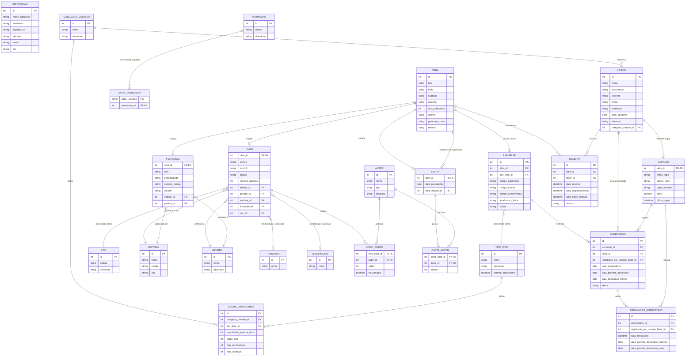

# Modelo de Dados — BEC

Este documento descreve as entidades centrais do domínio (instituição, leitores/usuários, acervo, empréstimos e regras de circulação) e o porquê de cada relação. Não é um ADR — é uma especificação que deve evoluir conforme a implementação avança.

Gatilho que motivou este documento: início da implementação do módulo de empréstimos (ver `docs/ARCHITECTURE.md`).

## Premissas assumidas (revisão 3)

Histórico: revisão 2 incorporou Autores, Editoras, Gêneros, Tradutores, Ilustrador, CDC, Reserva, Categorias de Usuário, Tipos de Item e Matriz de Empréstimo, e removeu o Calendário de Funcionamento. Esta revisão (4) separa regras de circulação de autorização, explicita as tabelas de junção bibliográficas, cria histórico de renovação e formaliza restrições de integridade. Decisões de modelagem seguem marcadas abaixo para revisão sua:

- **Autor vs. Tradutor vs. Ilustrador como tabelas separadas:** você pediu essas três como entidades distintas, e é assim que modelei. Vale registrar a alternativa: as três são, na prática, "pessoas relacionadas a uma obra com um papel diferente" — dá para unificar numa única tabela `CONTRIBUIDOR` (nome, biografia) com o papel definido na tabela de junção (`AUTOR`, `TRADUTOR`, `ILUSTRADOR`, `AUTOR_ESPIRITUAL`), evitando 3 tabelas quase idênticas e permitindo que a mesma pessoa apareça como autor num livro e tradutor em outro sem cadastro duplicado. Mantive como você pediu, mas é uma simplificação fácil de aplicar depois se fizer sentido.
- **Tradutor e Ilustrador são opcionais no Livro** (nem todo livro é traduzido ou ilustrado), enquanto **Editora e Gênero são obrigatórios**, como você especificou.
- **Autor** é reaproveitado também em `Carta` (médium = pessoa física, tipo `AUTOR`; autoria espiritual = tipo `AUTOR_ESPIRITUAL`) em vez de campos de texto livre — mais consistente e permite, por exemplo, listar toda a obra psicografada por um médium específico.
- **Múltiplos médiuns e/ou autores espirituais por obra:** a relação `LIVRO`–`AUTOR` (e agora também `CARTA`–`AUTOR`) já é muitos-para-muitos, e o papel de cada um (médium ou autor espiritual) vem do próprio `AUTOR.tipo` do registro vinculado — não é um atributo da relação. Isso já cobre todas as combinações que você descreveu sem precisar de campos extras: "2 médiuns + 1 autor espiritual" = 3 vínculos na obra (2 registros `AUTOR` com tipo `AUTOR`, 1 com tipo `AUTOR_ESPIRITUAL`); "1 médium + 1 autor espiritual" = 2 vínculos; "1 médium + 2 autores espirituais" = 3 vínculos. Por consistência, troquei os dois campos fixos que a `Carta` tinha (`medium_id`, `autor_espiritual_id`, que só permitiam 1 de cada) pela mesma relação muitos-para-muitos que o Livro usa — uma psicografia conjunta ou atribuída a mais de um espírito também passa a ser representável.
- **Categoria de leitor e acesso ao sistema são conceitos independentes:** `CATEGORIA_USUARIO` classifica somente o leitor para regras de circulação. Ela não concede acesso ao sistema. `USUARIO.papel_sistema` é um Enum fixo e controlado por código (`ADMIN`, `BIBLIOTECARIO`, ...); somente uma conta ativa pode autenticar. A decisão operacional e seus controles estão em [ADR-009](decisions/0009-autorizacao-e-auditoria.md).
- **Permissões granulares:** `PERMISSAO` e `PAPEL_PERMISSAO` descrevem as permissões concedidas a cada papel do sistema; nunca são ligadas à categoria do leitor. As chaves são semeadas e validadas pela aplicação, para que uma inclusão manual no banco não conceda uma capacidade que o backend não reconheça.
- **Revisão de engenharia sobre o rascunho que você colou:** três pontos foram avaliados e dois **não** foram incorporados — ver "Pontos rejeitados nesta revisão" abaixo, com a justificativa técnica. O terceiro (`INSTITUICAO.site`, `LIVRO.isbn10`/`isbn13` no lugar de `isbn` único) foi incorporado.
- **`CATEGORIA_USUARIO` confirmada como tabela, não Enum** — decisão avaliada e fechada: como ela alimenta a `REGRA_EMPRESTIMO` (matriz de empréstimo, uma tela de configuração do administrador) e cada instituição roda sua própria instância, categorias administráveis sem precisar de deploy fazem mais sentido do que valores fixos no código. O mesmo raciocínio já estava aplicado a `TIPO_ITEM`, que segue como tabela pelo mesmo motivo.
- **Tipos de Item** (Livro Circulante, Livro de Consulta Local, DVD, Revista) ficam no `EXEMPLAR`, não na `OBRA` — porque circulação é uma propriedade da cópia física, não do título (a mesma obra pode ter um exemplar circulante e outro só para consulta local).
- **Reserva** é feita por `OBRA` (título), não por `EXEMPLAR` específico — reservar "a próxima cópia que ficar livre" é o comportamento mais útil; se quiser reservar um exemplar específico (ex: uma edição rara), isso muda o modelo.
- **Calendário de Funcionamento foi removido** desta revisão a seu pedido. Consequência direta: o cálculo de `data_prevista_devolucao` volta a ser uma soma simples de dias corridos sobre `REGRA_EMPRESTIMO.prazo_dias`, sem pular feriados/fins de semana. Se isso voltar a ser necessário no futuro, a modelagem anterior (padrão semanal + exceções) fica disponível no histórico deste documento.
- **CDC (Classificação Decimal Espírita)** — nova entidade `CDC` (código + descrição, ex: `00.00.00 – Generalidade`), usada para classificar o acervo por assunto, no mesmo espírito da Classificação Decimal de Dewey. O código já carrega a hierarquia na própria notação (pontos separando níveis), então não modelei uma tabela de hierarquia (`parent_id`) separada — se a navegação por árvore de assuntos precisar disso no futuro (ex: listar "tudo dentro de 00.\*"), dá para adicionar depois sem quebrar o que já existe.
- **Livro exige CDC** (`LIVRO.cdc_id` obrigatório) e **exige pelo menos 1 autor** — a relação `LIVRO`–`AUTOR` foi ajustada para "um ou muitos" do lado do autor (antes permitia livro sem nenhum autor). Você mencionou CDC só para Livro; deixei Periódico e Carta sem essa obrigação por ora — avise se também devem ser classificados por CDC.
- **Matriz de Empréstimo** cruza Categoria de Usuário × Tipo de Item numa tabela de regras (`REGRA_EMPRESTIMO`), definindo quantidade máxima de itens, prazo em dias, renovações e reservas permitidas — exatamente como descrito.

## Diagrama ER

> `CDC.codigo` carrega a hierarquia de classificação na própria notação (ex: `00.00.00`), sem necessidade de tabela de árvore separada nesta fase.

## Regras de negócio derivadas do modelo (não são tabelas)

- **Prazo de devolução:** ao criar um `EMPRESTIMO`, o prazo em dias vem de `REGRA_EMPRESTIMO` (cruzando a `categoria_usuario` do leitor com o `tipo_item` do exemplar); a data final é `data_emprestimo + prazo_dias` (dias corridos — sem calendário de funcionamento nesta revisão).
- **Limite de itens simultâneos e renovações:** também vêm de `REGRA_EMPRESTIMO` — o sistema precisa validar, antes de criar um novo empréstimo, quantos itens daquele tipo o leitor já tem emprestados.
- **Renovação:** cada renovação cria um registro em `RENOVACAO_EMPRESTIMO`; a quantidade de registros vinculados ao empréstimo não pode ultrapassar `REGRA_EMPRESTIMO.max_renovacoes`. A data de devolução do empréstimo é atualizada para a nova data, preservando o histórico.
- **Exemplares "sem circulação"** (`TIPO_ITEM.permite_emprestimo = false`, ex: Livro de Consulta Local) nunca devem aparecer como emprestáveis, independentemente da categoria do leitor.
- **Fila de reserva:** a prioridade é FIFO pela data/hora de criação. Quando uma cópia é devolvida, a reserva ativa mais antiga passa a `DISPONIVEL`; ela expira em `data_limite_retirada` se não for retirada. Estados permitidos: `ATIVA`, `DISPONIVEL`, `ATENDIDA`, `CANCELADA` e `EXPIRADA`.

## Restrições de integridade e índices mínimos

- `USUARIO.email_login`, `PERMISSAO.chave`, `CDC.codigo`, `EXEMPLAR.codigo_patrimonio` e `EXEMPLAR.codigo_barras` devem ser únicos. O documento do leitor é único quando informado, após normalização.
- `REGRA_EMPRESTIMO` deve ter unicidade em (`categoria_usuario_id`, `tipo_item_id`).
- `LIVRO_AUTOR` e `CARTA_AUTOR` devem ter unicidade em seus dois FKs; a ordem deve ser positiva e única dentro de cada obra. Um livro deve possuir ao menos um vínculo em `LIVRO_AUTOR`.
- `LIVRO_AUTOR.eh_principal` pode ser verdadeiro para no máximo um autor de cada livro.
- Uma `OBRA` deve ter exatamente um subtipo compatível com `OBRA.tipo` (`LIVRO`, `PERIODICO` ou `CARTA`). Essa invariável deve ser protegida no serviço de aplicação e por migração/constraint compatível com PostgreSQL.
- Campos de estado (`situacao`, `status`, `papel_sistema`) são enums controlados pelo domínio; valores externos são rejeitados no adaptador de entrada.
- Índices devem cobrir FKs, empréstimos abertos por leitor/exemplar, reservas ativas por obra e a busca normalizada de título, autor e código de barras.

## Pontos rejeitados nesta revisão (com justificativa)

Seu rascunho trouxe dois pontos que, como engenheiro, eu não incorporaria do jeito que estavam — ambos quebram integridade do modelo, não são só estilo:

**`LIVRO.autor_principal` e `LIVRO.autor_coautores` como colunas FK.** Uma coluna de chave estrangeira guarda **um** valor. "Coautores" é plural por definição — não existe forma de uma única coluna `autor_coautores FK` referenciar mais de um `AUTOR` ao mesmo tempo; isso não é um detalhe de sintaxe, é uma limitação estrutural do modelo relacional. Se essas duas colunas fossem implementadas literalmente, o sistema voltaria a só suportar 1 autor por livro (contradizendo a decisão que fechamos: "1 ou muitos autores", incluindo múltiplos médiuns e múltiplos autores espirituais). Note também que seu rascunho mantinha a relação direta Livro–Autor ao mesmo tempo que adicionava essas colunas — as duas formas competem para representar a mesma informação, e isso por si só já é sinal de que uma delas está sobrando. O modelo usa a tabela de junção `LIVRO_AUTOR`, que resolve o caso completo sem essa limitação. Se a intenção era distinguir "autor principal" dos demais para fins de exibição (ex: capa mostra só o primeiro nome), a forma correta é um atributo *na relação* (ex: `ordem` ou `eh_principal` na tabela de junção `LIVRO_AUTOR`), não uma coluna fixa em `LIVRO` — mecanismo diferente do que foi rascunhado, mas resolve a mesma necessidade sem quebrar a multiplicidade.

**`LIVRO.codigo_de_barras`.** Código de barras já existe em `EXEMPLAR.codigo_barras` — e ali é o lugar certo, porque o código de barras é impresso e escaneado por **cópia física**, não por título. Duas cópias do mesmo livro têm códigos de barras diferentes (é assim que o sistema sabe qual exemplar específico foi emprestado). Duplicar o campo em `LIVRO` cria duas fontes de verdade para o mesmo conceito — na prática, ou o campo em `LIVRO` fica sempre vazio/não utilizado (código morto no schema), ou alguém eventualmente preenche os dois com valores diferentes e o sistema não sabe qual confiar na hora de escanear um exemplar no balcão. Não incorporei essa coluna.

Também vale registrar, sem bloquear nada: `LIVRO.issn` apareceu no seu rascunho anterior (já removido nesta revisão) — ISSN é identificador de **publicação seriada** (usado em `PERIODICO`), não de livro; um livro pode até pertencer a uma coleção numerada, mas isso seria melhor representado como um relacionamento para uma futura entidade "Coleção/Série", não como ISSN direto no Livro. Deixei de fora por ora; avise se seu acervo realmente cataloga livros com ISSN de coleção.

## Decisões de modelagem que ainda precisam de dono

- **Unificar Autor/Tradutor/Ilustrador em uma tabela `CONTRIBUIDOR` com papel** — mantido separado por ora a seu pedido; considere revisar se o cadastro de pessoas ligadas a obras crescer (ex: um autor que também traduz).
- **Campos bibliográficos detalhados do Livro** (ISBN-10/13, DOI, número de controle, código de barras): sua mensagem trouxe uma lista bem mais completa de metadados (padrão MARC21/RDA) que parece ter sido cortada no meio. Incluí um subconjunto pragmático (ISBN, edição, número de páginas, código de barras no exemplar); se você quiser o padrão bibliográfico completo, me envie a lista completa que eu incorporo.
